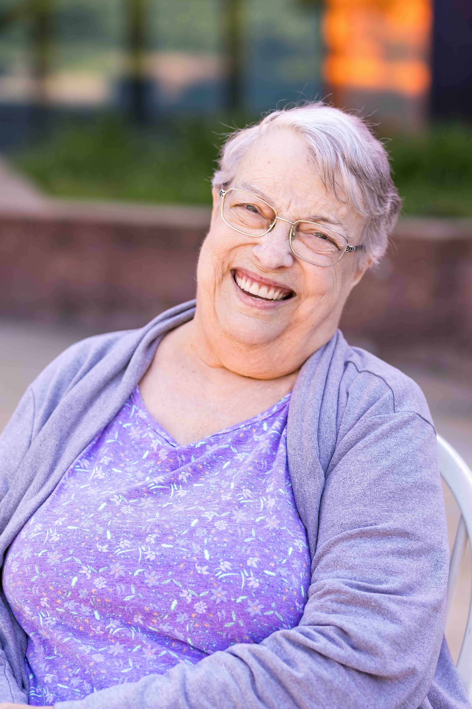
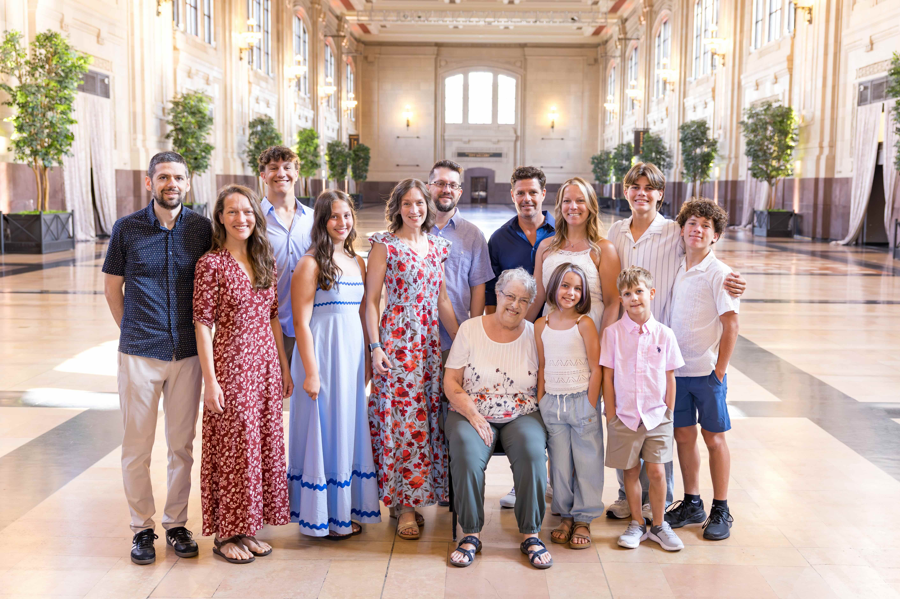
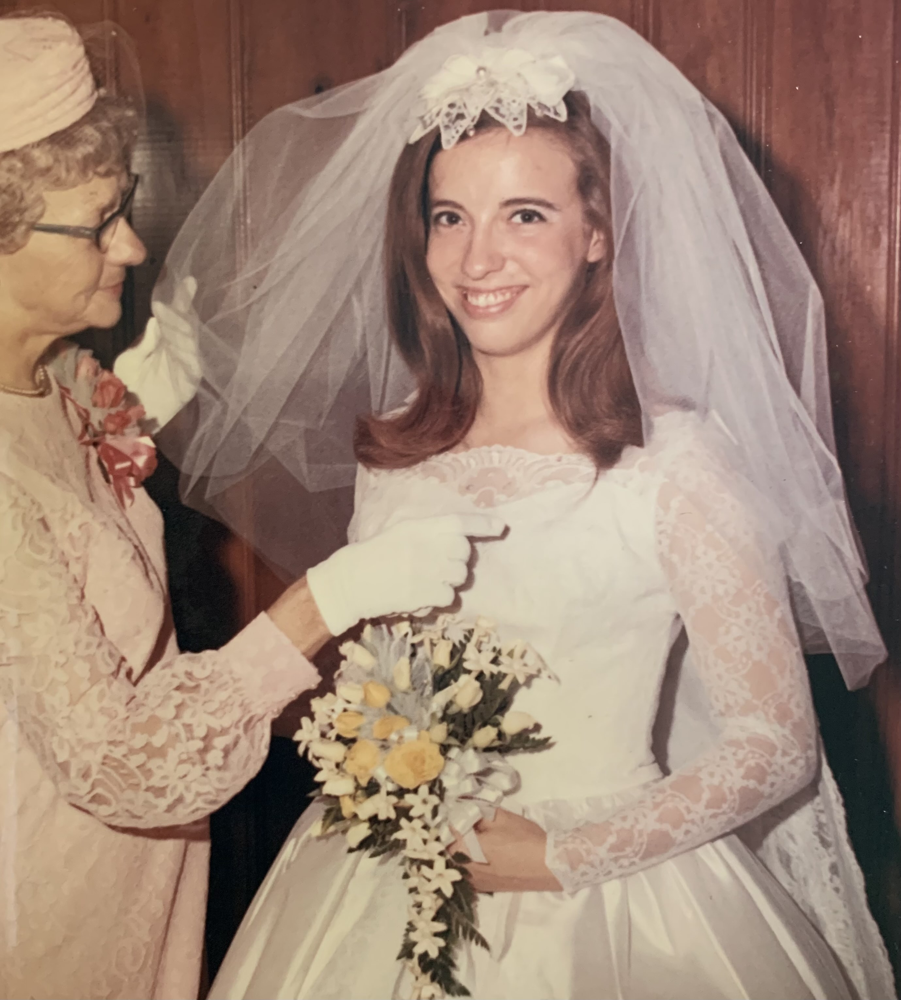
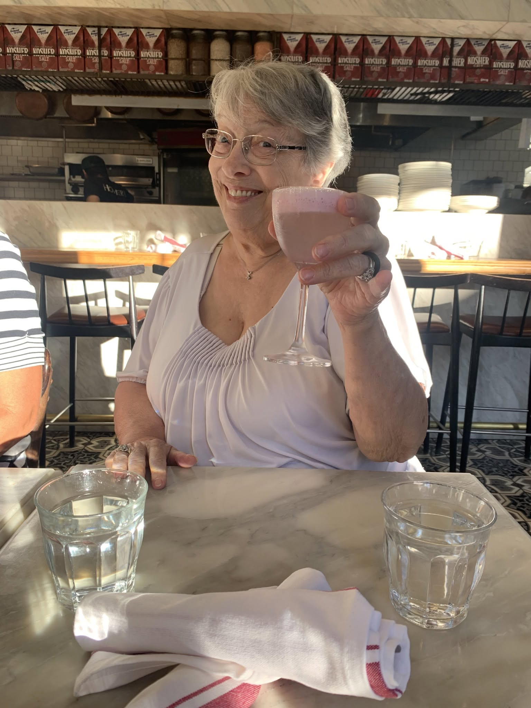

{.lightbox width=500px fig-align="center"}

### Ruth Ann (Dion) Mitchell passed away on June 18, 2026, surrounded by her family.

---

> But the shadow side of love is always loss, and grief is only love's own twin.
>
> --- _Late Migrations_ by Margaret Renkl

Ruth was predeceased by her husband of 51 years, Colonel John William “Pat” Mitchell, Jr. Together they raised four children: Dionna (Tom) Ford, Shawna Mitchell, Tamara (Daniel McDonald) Mitchell, and Monty (Tonna) Mitchell. Ruth gladly welcomed into the fold Pat’s bonus daughter, Beth (Mike) Bostrom, who they discovered late in life. Ruth leaves a legacy of love through her grandchildren: Dionna’s Kieran and Ailia; Shawna’s Rhonin, Toryn, Ryann, and Logan; Monty’s Tyler, Mackenzie, Dakota, Harmony, Elizabeth, Rylan, Evan, and Brayden; and several great-grandchildren. Ruth also leaves behind her beloved Laddie, who began life as Pat’s service dog and retired as a spoiled, Kong ball-obsessed fur baby.

{.lightbox width=800px fig-align="center"}

Ruth was born in Kansas City, Missouri, on January 8, 1949, to Frederick and Genevieve (Hader) Dion. She grew up in Independence, Missouri, surrounded by a cadre of doting adults—including half-brother Ralph Dion, whom she loved to visit in California; Grandma Lucy Hader, who lived with the Dions late in life; Aunt Alice Dion, a devoted servant of God; and two eccentric, honorary aunts, Mertie and Gertie Hite, better known as the “Hat Pin Twins” due to their antics at local pro wrestling events.

Ruth developed her most sustaining and important relationship as a member of the Independence First Baptist Church—that with her Lord and Savior, Jesus Christ. The Reverend Harold Hunt, pastor of First Baptist, was her father’s best friend and an honorary member of the Dions’ extended family. Ruth’s childhood was filled with memories of Bible school, singing in the church choir, and watching as her father played cards with Reverend Hunt and members of Independence’s political circle—including Harry S. Truman.

Ruth graduated in 1967 from Raytown High School and attended two years at William Jewell College in Liberty, Missouri, as a music major. It was at William Jewell where she was swept off her feet by Pat. He visited the college as an Army recruiter, but she liked to say that he was the one who got recruited. Their love story began through a prolonged exchange of love letters while Pat served in Vietnam, and they married on June 29, 1969, at First Baptist Church.

{.lightbox width=500px fig-align="center"}

The military took Pat and his “Ruthie” all over God’s green earth—from Fort Sill, Oklahoma, to Monterey, California, and from Bangkok, Thailand, to many cities across the state of Kansas. Ruth was proud to support her country and Pat’s career, introducing herself to everyone first and foremost as a military wife. She was the heart and soul of their union. Her warm smile and infectious laugh spread joy in every room she entered, and she was always ready to lend a hand. Through more than a dozen moves during her marriage, Ruth never failed to bloom where she was planted.

Wherever life took her, Ruth faithfully put down roots in her church family. She attended Highland Park Baptist Church in Topeka, Kansas, for 27 years, serving as pianist, a leader of the praise team, and honorary kitchen staff during Sunday potlucks. She was blessed with abiding friendships that began at HPBC. More recently, she spent 12 years at Cornerstone Baptist Church in Inverness, Florida. She loved singing with their senior choir, and she found purpose volunteering at the church office where she cared deeply for the staff and volunteers.

Before retiring in 2010, Ruth worked for many years at Dillons Pharmacy and at Sears in Topeka, Kansas, but she would say her true calling was as a mother and grandmother. She was thrilled to share her love of music with Dionna. Her heart was full when they led music together at HPBC, and she adored accompanying Dionna’s violin solos. At softball games, Ruth was the loudest and proudest mom, cheering on Shawna and Tammy. Some of her favorite memories were scorekeeping at Lake Shawnee and chauffeuring the girls to weekend tournaments across the Midwest. She wore her status as a military mom like a badge of honor, bragging about Monty’s service in the U.S. Marines and the Army National Guard at every turn.

She could not have been a more doting grandmother. “Grandma’s” heart swelled watching Kieran and Ailia onstage, and “Memaw” was thrilled every time she saw Rhonin, Toryn, Ryann, or Logan on the field. Her grandchildren were her life’s greatest blessings.

Outside of her family and faith, Ruth had a gift for enriching the lives of others. She cultivated a community online through blogging and advocacy groups, including the Raptor Resource Project, Operation Migration, and the PTSD Projects Caregiver Group. She and Pat traveled numerous times to Decorah, Iowa, where she formed deep friendships with fellow eagle buffs. In Florida, she enjoyed fellowship and food with a dear group of friends dubbed the “Craniacs.” She spent hours volunteering with Nature World Wildlife Sanctuary, and she generously supported a variety of nature rescues online.

After she lost Pat in 2020, she fell in love with a wonderful group of friends in Inverness, with whom she enjoyed weekly bridge games, dinners out, and all kinds of mischief. Their love and friendship was one of the sweetest joys in her twilight years.

{.lightbox width=500px fig-align="center"}

> Because I have loved life, I shall have no sorrow to die.\
> I have sent up my gladness on wings, to be lost in the blue of the sky.\
> I have run and leaped with the rain, I have taken the wind to my breast.\
> My cheeks like a drowsy child to the face of the earth I have pressed.\
> Because I have loved life, I shall have no sorrow to die.\
>
> I gave a share of my soul to the world, when and where my course is run.\
> I know that another shall finish the task I surely must leave undone.\
> I know that no flower, nor flint was in vain on the path I trod.\
> As one looks on a face through a window, through life I have looked on God,\
> Because I have loved life, I shall have no sorrow to die.
>
> --- _A Song of Living_ (stanzas 1 & 3), by Amelia Josephine Burr

---

In lieu of flowers, memorials may be made in Ruth Mitchell’s name to

* [Nature World Wildlife Rescue](https://www.natureworldrescue.com/) in Homosassa, FL;
* Highland Park Baptist Church in Topeka, KS (checks may be mailed care of HPBC P.O. Box 5224 Topeka, KS 66605);
* [Cornerstone Baptist Church](https://atthecorner.church/give/) in Inverness, FL.
